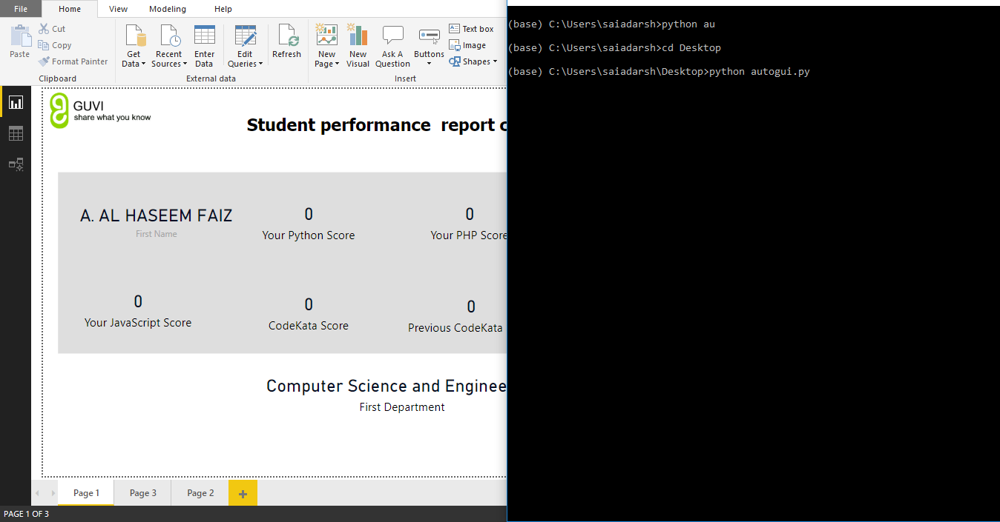

# Power BI template for Guvi with GUI automation


## Clone & run
```sh 
git clone https://github.com/Sai-Adarsh/Guvi-ReportCard-PowerBI-Template \
cd Guvi-ReportCard-PowerBI-Template 
```

* Import the template in Power BI, click *get data* and load the sample csv file.
* Run the python GUI file:
```sh
cd GUIautomation
python autogui.py
```
## Screenshot

